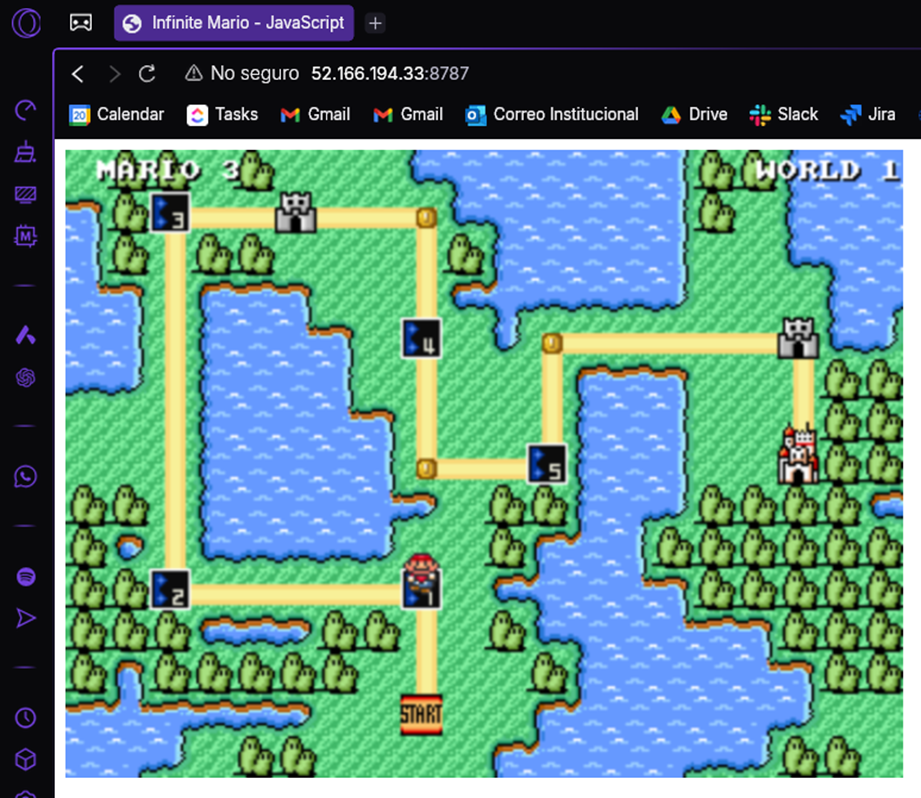

# Terraform Virtual Machine Ansible Workshop

Este taller tiene como objetivo desplegar una máquina virtual (VM) utilizando Terraform, y montarle un contenedor de Docker usando ansible. Dado que los pasos para el despliegue de la VM son exactamente los mismos a los del taller anterior, se saltarán. En caso de querer verlos, visitar el siguiente [repositorio](https://github.com/yuluka/terraform_vm_modularization_workshop.git).

A continuación, se detallan los pasos esenciales para el desarrollo.

## By

Yuluka Gigante Muriel

---

## Prueba de conexión con ansible

Antes de iniciar, la VM debe estar desplegada y correctamente configurada. Una vez que está de esa manera, hay que probar ansible pueda conectarse a esta, usando el archivo `inventory/hosts.ini`:

```bash
ansible all -i inventory/hosts.ini -m ping
```

Debería resultar algo como:


Por supuesto, para que funcione, `inventory/hosts.ini` debe configurarse apropiadamente:

```ini
[azure_vm]
IP_VM ansible_user=USUARIO_CONFIGURADO ansible_ssh_pass="CONTRASEÑA_CONFIGURADA"
```

> **Nota:** Tener la contraseña quemada en este archivo no es nada seguro ni recomendable. Sin embargo, por cuesrtiones de practicidad, y en entornos de prueba, puede estar bien.

## Configurar Docker

Sabiendo que ansible puede comunicarse, sin problemas, con la VM desplegada, es momento de pasar a la ejecución del `playbook` que se encarga de la instalación y configuración de Docker:

```bash
ansible all -i inventory/hosts.ini playbooks/install_docker.yml
```

En caso de que todo esté bien, debería salir algo así:


**Nota:** En mi caso, el archivo de configuración de ansible, `ansible.cfg`, no estaba siendo reconocido, por lo que obtenía un error indicando que los roles no se encontraban. Para solucionarlo, moví `roles/` dentro de `playbooks/` y todo funcionó.

Dado que todo parece haber ido bien, hay que revisar que haya quedado bien instalado en la VM:

```bash
ansible azure_vm -i inventory/hosts.ini -m shell -a "docker --version"
```

Lo que debería dar un resultado como:


## Montar contenedor

Como la instalación y configuración Docker se ha hecho correctamente, se debe montar el contenedor de docker que contiene la imagen del Super Mario:

```bash
ansible-playbook -i inventory/hosts.ini playbooks/run_container.yml
```

Esto debería mostrar algo como:


## Abrir nuevo puerto

Todo parece haber ido bien, por lo que es momento de probar si el contenedor quedó bien montado y en el puerto apropiado. Sin embargo, la VM está configurada para solo tener abierto el puero `22` (para la conexión SSH), por lo que es necesario abrir uno nuevo (el `8787`).

Para esto, en `modules/vm/variables.tf`, hay que definir una nueva regla dentro de la lista:

```hcl
{
  name                       = "mario_rule"
  priority                   = 101
  direction                  = "Inbound"
  access                     = "Allow"
  protocol                   = "Tcp"
  source_port_range          = "*"
  destination_port_range     = "8787"
  source_address_prefix      = "*"
  destination_address_prefix = "*"
},
```

Luego, hay que asegurarse de que nada se dañó, usando `terraform plan`, lo que debería dar algo como:


Y, dado que todo se ve bien, aplicar los cambios con `terraform apply`:


## Verificar resultado

Como todo parece estar saliendo bien, es hora de ir al navegador para probar el funcionamiento correcto:



Todo funciona a la perfección :-)